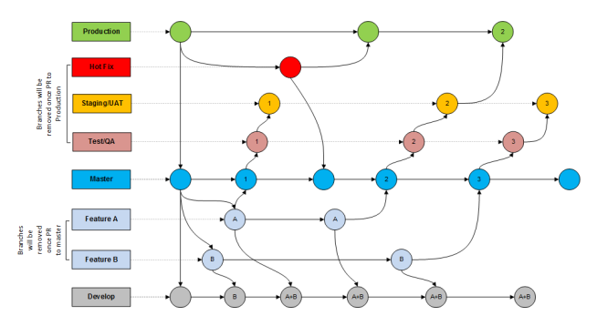
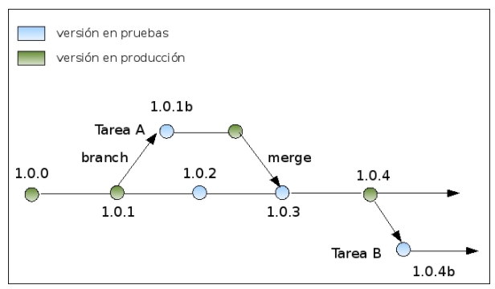

# 2020B-Libres-TopSpoiler.github.io

&nbsp;&nbsp;&nbsp;&nbsp;

&nbsp;&nbsp;&nbsp;&nbsp;

TopSpoliers es una plataforma para la distribución de los diferentes spoilers de mayor popularidad en la comunidad del manga, mediante el uso de textos explicitos publicados por diferentes usuarios.

Tabla de Contenidos
=======================

* [Descripción](#descripción)
* [Objetivos](#objetivos)
* [Fundador](#fundador)
* [Roles](#roles)
* [Etiquetas](#etiquetas)
* [Licencia](#licencia)
* [Lista de Correos](#lista-de-correos)
* [Gestión](#gestión)
* [Toma de Desiciones](#toma-de-desiciones)
* [Obtención de Recursos](#obtención-de-recursos)
* [Utilización de Recursos](#utilización-de-recursos)
* [Estrategia de Ramas](#estrategia-de-ramas)
* [Estrategia de Versionamiento](#estrategia-de-versionamiento)
* [Canales de Comunicación](#canales-de-comunicación)

---

Descripción
-------

El Proyecto TopSpoilers conlleva un desarrollo escalable de acuerdo a los parametros establecidos por la comunidad del manga, en los que estan incluidos el derecho a la libre expresion y contribucion de la comunidad, cada vez que los mangacas principales o los autores de los mismos realizen lanzamientos de información en las entevistas, estos serán tomados en cuenta como información escencial para nuestra Comunidad. 

Objetivos
-------

#### Objetivo Principal

El objetivo principal de mi Aplicación Web es la distribución de Spoilers en formato de texto antes del lanzamiento oficial del manga.

#### Objetivos Específicos

* TopSpoilers brindará acceso a nuestra comunidad a travez de nuestro Discord
* TopSpoilers emitirá los spoilers de los principales mangas que esten en augue.
* TopSpoliers certificará el contenido real de un spoiler, mediante nuestra comunidad.

Fundador
-------

* [Omar Tuitice]( https://github.com/omarcotg1)

Roles
-------

Los Principales roles en TopSpoilers son los siguientes: Desarrollador, Documentación e Historias de Usuario, los cuales conformarán parte de la dirección de comunidad de TopSpoilers. Por tanto los Roles secundarios en TopSpoilers son: Discord, Bugs, Seguridad, Traductor, Verificador, Aceptación, Administrador de Red. Cabe mencionar que los roles principales se encargarán de tareas complejas relacionadas a la gestión del proyecto. 

Desarrollador 
Documentación 
Historias de Usuario
Discord
Bugs
Seguridad
Traductor
Verificador
Aceptación
Administrador de Red

Etiquetas
-------

Las Etiquetas que maneja nuestra Aplicación Web para la comunidad de TopSpoilers se listan a continuación:

[Ingrese a las Etiquetas](https://github.com/2020B-Libres-TopSpolier/2020B-Libres-TopSpoiler.github.io/labels)

* Mangas
* Spoiler
* Lanzamientos
* Ayuda
* Bug
* Preguntas
* Verificación
* Desarrollo
* Desiciones
* Mejoras
* Invalidar

Licencia
-------

TopSpoilers esta usando la [Licencia](https://github.com/2020B-Libres-TopSpolier/2020B-Libres-TopSpoiler.github.io/blob/main/LICENSE) GNU General Public License, version 2.

Lista de Correos
--------

La lista de correos para miembros de nuestra comunidad para que visite nuestra página y se nos una, se encuentra a continuación:

[Visita nuestra página TopSpoilers](https://2020b-libres-topspolier.github.io/2020B-Libres-TopSpoiler.github.io/)

Gestión
----

  #### Normativa

Respeto entre sus contribuyentes siguiendo las reglas principales de la comunidad de TopSpoilers. El comportamiento de sus contribuidores debe ser ejemplar a nivel social y politico por lo que reprersentamos a toda una comunidad de personas honestas y trabajadoras. En TopSpoilers estableceremos una soberanía de toda la comunidad con el derecho
a elegir y controlar sus reglas y ambiciones.

> "No obstante el Administrador y CEO de TopSpoilers tomará la ultima palabra para la desiciones criticas del Proyecto"

Toma de Desiciones
-------

Par la toma de desiciones, se evaluará el tipo de desiciones que deben ser tomadas en el proyecto TopSpoilers, siempre que sea para mejorar.
La desiciones las tomarán los miembros principales de la comunidad y que tenga el rango de "Reyes Piratas" y que al menos hayan estado contribuyendo al pryecto, al menos 2 años calendario.

A continuación se menciona cuales son las desiciones mas críticas de nuestro proyecto:

  #### Tipos de Desiciones Críticas

* Cambiar las reglas principales de la comunidad.
* Cambiar los tipos de mangas.(Dragon ball, One Piece, Shigeki no kiogin)
* Dar de baja un Rol
* Dar de baja a un Contribuidor
* Cambiar el entorno de desarrollo del Proyecto para futuras adaptaciones, etc.

Obtención de Recursos
-------

Dentro del proyecto TopSpoilers se finanacirá inicialmente con sus propios recursos, si embargo se recibirá donaciones mediante PAYPAL y nuestra cuenta Bancaria.
Cabe mencionar que en caso de tener insuficiencia de recursos a futuro para miembros de nuestra comunidad, se evaluarán diferentes maneras de la obtención de recursos como:

* Soporte y mantenimiento
* Concursos de menciones
* Licenciamiento Doble
* Publicidad en pantalla

Utilización de Recursos
-------

Los recursos que sean recibidos, inicialmente por donaciones voluntarias por parte de nuestra comunidad, serán utilizados para la mejora continua de nuestro proyecto TopSpoilers, a menos que algún miembro de nuestra comunidad padezca, alguna situación de grave indole, estos recursos serán donados inmediantamente.

Estrategia de Ramas
-------

Nuestra estrategia de Ramas se basa fundamentalmente en la creación de tres ramas principales que serán de apoyo principal para nuestro proyecto.

Mastero Rama Principal: se la utilizará para el proyecto o resultado final del mismo.
Rama de Produccion: es una rama de desarrollo total antes de la funsion de las diferentes tareas de nuestro proyecto.
Rama de Desarrollo: se la utilizará para elaboras los features y brindar un entorno de pruebas de integración.

A continuación se observa nuestra Estrategia de Ramas:

Estrategia de Versionamiento
-------
Nuestra estrategia de versionamiento constará de una versión de pruebas y una versión de producción, las cuales estarán localizadas en una sola rama para su posterior lanzamiento de versiones de TopSpoilers, como se observa a continuación:

Canales de Comunicación
-------

Nosotros como miembros de una comunidad de Software Libre, estaremos comunicados mediante la plataforma de libre acceso como Discord. Claro esta que los miembros que conformen nuestra comunidad de TopSpoilers deberán guardar respeto mutuo entre nuestros colaboradores y poseer empatía hacia los demás. A continuación se encuentra en canal de enlace a nuestra red social.

[Visita nuestro Discord](https://discord.gg/JNdBnHFB)

